# ebase

**Outreach that won't get you flagged.**

LinkedIn recruiting outreach that runs inside Claude Code — in your own signed-in Chrome, under LinkedIn's safe limits, so your account stays clean.

100% free. Open source. MIT licensed. Read every line before it touches your LinkedIn.

---

### Cold to booked call in three sentences

<p align="center">
  
</p>

That whole session starts with **one command**.

---

## Install

<!-- REPO_URL: update when the repo moves -->
```bash
curl -fsSL https://raw.githubusercontent.com/embeddingvc/ebase/main/install.sh | bash
```

Then run **`/setup-outreach`** in Claude Code to configure your operator profile from LinkedIn.

**Requirements:** macOS · Python 3.10+ · Claude Code

<details>
<summary>What the installer does</summary>

The script does **not** require **Make** (suitable for a fresh Mac before Xcode Command Line Tools). It:

- Installs **[uv](https://docs.astral.sh/uv/)** if it is missing, then runs **`uv sync`** and **`playwright install chromium`** (same as **`make install`**).
- **Default:** registers the LinkedIn MCP with Claude Code **`--scope user`** (all projects; stored in **`~/.claude.json`**). Copies each skill under **`outreach/skills/<name>/`** (with **`SKILL.md`**) into **`~/.claude/skills/<name>/`**. Set **`EBASE_SYNC_SKILLS_HOME=0`** to skip the skill copy only.
- **`--local`** (or **`EBASE_INSTALL_LOCAL=1`**): MCP **`--scope local`** only (this absolute project path); **does not** copy skills to **`~/.claude/skills`**. Same idea as **`make claude-install LOCAL=1`**.
- Pre-allows ebase in Claude Code settings: MCP (`mcp__linkedin`), all repo skills (`Skill(...)`), and maintenance bash (`bin/outreach-*`, `install.sh`, `uninstall.sh`, `make upgrade` / `uninstall` / `claude-install`). Writes to **`~/.claude/settings.json`** in default mode, or **`<repo>/.claude/settings.local.json`** with **`--local`**.
- If **`claude`** is missing, it prints next steps. **`./install.sh --help`** lists options.
- Launches **Google Chrome** on macOS at the default path with remote debugging (CDP) on port **9222** (same idea as **`make browser`**), opens **LinkedIn login**, and **pauses until you press Enter** after signing in. Playwright automation attaches to that live Chrome session. Skip the pause with **`./install.sh --skip-linkedin-login`**.
- Starts the **cron scheduler server** in the background (health: **http://127.0.0.1:3847/health**, logs: `logs/cron.log`). It runs the unattended routine sweeps (connection sync, conversation planning). Skip with **`./install.sh --no-cron`**.

Once it finishes, run **`/setup-outreach`** in Claude Code to scrape your LinkedIn profile, review the draft persona, and save `outreach/config/persona.json`. The cron scheduler then runs the workflow unattended; check it with **`make status`**.

By default this clones or updates the repo at **`~/ebase`**. Override the directory with **`EBASE_DIR`**, the remote URL with **`EBASE_REPO`** (for forks), or **`git clone`** the repo and run **`./install.sh`** from the repository root so an existing clone is used instead.

</details>

---

## Why ebase

### Your account stays safe

Every other outreach tool eventually gets your LinkedIn flagged. ebase doesn't blast — daily caps match what LinkedIn actually tolerates:

| Action | Daily limit |
|--------|------------|
| Connection requests | 25 |
| Direct messages | 50 |
| Profile views | 100 |

It hits the cap and stops with "resume tomorrow." No override, no workaround.

### It runs in your real Chrome

ebase drives your signed-in Chrome session over CDP — not a headless browser, not a bot account, nothing for LinkedIn to fingerprint. You keep browsing normally while ebase works the pipeline alongside you.

### One sentence in, real outreach out

No dashboard to learn. No per-seat fees. Say what you want in plain English:

```
› connect to linkedin.com/in/maya-khatri
› book a meeting with linkedin.com/in/jordan-liu
› ask linkedin.com/in/sara-ramos for her resume
› follow up with last week's accepts
```

Each ask runs as a Claude skill — ebase reads the profile, writes in your voice, sends, and logs it to your pipeline.

---

## What's inside

| Component | Description |
|-----------|-------------|
| **LinkedIn MCP server** | 30 tools — profiles, connect, message, engage, persist |
| **Claude skills** | 5 chainable workflows in `~/.claude/skills` |
| **Queue worker** | Batch automation from JSON queue files |
| **Cron scheduler** | Auto-syncs accepts, plans follow-ups, respects rate limits |
| **Per-user state** | Isolated prospects, threads, logs (JSON / JSONL) |
| **One-command installer** | uv · Playwright · MCP register |

---

## How it works

1. **Install once** — one curl command. uv, Playwright, the MCP server and skills register with Claude Code.
2. **Sign in to Chrome** — ebase drives your real, authenticated Chrome session. Nothing headless, nothing to flag.
3. **Ask Claude** — "Connect to this profile." "Follow up with last week's accepts." Natural language in, real outreach out.
4. **It stays safe** — every action is logged and capped to LinkedIn-safe daily limits. The agent refuses to cross them.

---

## Documentation

- **[Quickstart (live + mock)](docs/quickstart.md)** — `make run`, live mode checklist, example prompts
- **[Architecture & capabilities](docs/architecture.md)** — components, MCP tool inventory, workflow diagrams
- **[Claude skills](docs/skills.md)** — `setup-outreach`, `conversation-planner`, `send-connection-request`, and more
- **[Manual install & Claude Desktop MCP](docs/install.md)** — prerequisites, `make install`, `claude_desktop_config.json`
- **[Conversation planner config](docs/conversation-planner.md)** — runtime persona + campaign config
- **[Operations](docs/operations.md)** — environment variables, data layout, Make targets
- **[Design notes](docs/designs/)** — internal design docs
- **[Testing & dev dashboard](testing/README.md)** — web dashboard UI, mock mode, regression suite
- **[Contributing](CONTRIBUTING.md)** — dev setup, testing, how to submit changes
- **[Changelog](CHANGELOG.md)** — version history and release notes

## License

[MIT](LICENSE)
