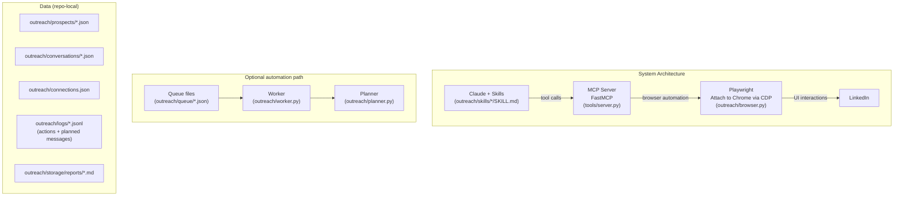
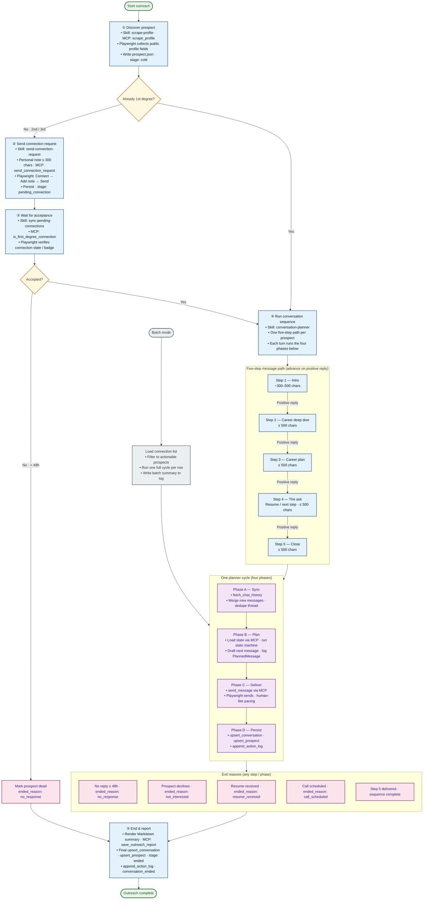

# LinkedIn Outreach

Automation + workflow tooling for LinkedIn outreach. This repo provides:

- A **LinkedIn MCP server** (`tools/server.py`) that exposes LinkedIn actions as tools (Playwright attaching to a real Chrome session via CDP).
- A **queue-draining worker** (`outreach/worker.py`) for “run jobs from JSON queue files” automation.
- A **message planner** (`outreach/planner.py`) that can generate copy in **API mode** (Anthropic) or **stub mode** (offline).
- Claude **skills** under `outreach/skills/` that orchestrate end-to-end outreach using MCP tools.

## What you can do

- **Profile data**
  - `scrape_profile`: quick structured scrape (includes `recent_posts` and also captures `raw_text`)
  - `parse_profile`: deeper multi-page crawl with a **structured** output (`linkedin.parse_profile/v2`) and activity metrics (no raw page dump)
- **Connection + messaging**
  - `send_connection_request` (optional ≤300 char note)
  - `is_first_degree_connection` (used to promote pending → connected)
  - `fetch_chat_history`
  - `send_message`
- **Content / engagement**
  - `create_new_post`
  - `reply_to_post`
  - `browse_forever` (background “human-like” feed browsing)
- **Outreach persistence (server-managed filesystem I/O)**
  - `get_*`, `upsert_*`, `append_*`, `save_connection`, `save_outreach_report`, `remove_pending_queue_entry`

## Architecture (high level)



## Prerequisites

- **Python** 3.10 or newer  
- **[uv](https://docs.astral.sh/uv/)** (recommended) for environments and `uv run`  
- **Google Chrome** (live mode): used with remote debugging so Playwright can attach  
- **Claude Desktop** (or another MCP host that supports stdio MCP servers)
- **Make** (for `make install`, `make browser`, etc.)

### macOS: Install Make

Apple ships **GNU Make** with the Xcode Command Line Tools. If `make --version` fails in Terminal:

1. Run:

   ```bash
   xcode-select --install
   ```

2. Complete the installer dialog, then confirm:

   ```bash
   make --version
   ```

You can still use **`uv`** commands everywhere if you prefer not to install the Command Line Tools; `make` is only a convenience wrapper around those commands.

## One-command install (clone, deps, MCP, skills, Chrome)

From any directory, download and run the installer (uses [bash](https://www.gnu.org/software/bash/)):

```bash
curl -fsSL https://raw.githubusercontent.com/huangruoqi/LinkedIn-Outreach/main/install.sh | bash
```

By default this clones or updates the repo at **`~/LinkedIn-Outreach`**. Override the directory with **`LINKEDIN_OUTREACH_DIR`**, the remote URL with **`LINKEDIN_OUTREACH_REPO`** (for forks), or **`git clone`** the repo and run **`./install.sh`** from the repository root so an existing clone is used instead.

The script does **not** require **Make** (suitable for a fresh Mac before Xcode Command Line Tools). It:

- Installs **[uv](https://docs.astral.sh/uv/)** if it is missing, then runs **`uv sync`** and **`playwright install chromium`** (same as **`make install`**).
- If the **[Claude Code](https://docs.anthropic.com/en/docs/claude-code) CLI** (`claude`) is on your **`PATH`**, registers the LinkedIn stdio MCP server (same as **`make claude-install`**; skills live under **`.claude/skills/`** in the repo). If `claude` is not installed, it prints the exact shell commands to run later.
- Launches **Google Chrome** on macOS at the default path with remote debugging (CDP) on port **9222** (same idea as **`make browser`). **Sign in to LinkedIn in that Chrome window.** Playwright automation attaches to that live Chrome session.

## Install the project

From the repository root:

```bash
make install
```

Or use **`./install.sh`** from the repo root (skips cloning; uses **`uv`** and **`claude`** only—no **Make**).

This will:

- Create/sync the `uv` environment (`uv sync`)
- Install Playwright’s Chromium runtime (`playwright install chromium`)

## Quickstart (live browser automation)

Day-to-day, the simplest flow is:

```bash
make run
```

That will:

- Start Chrome (if not already running) with a dedicated profile and CDP port.
- Start the worker in the foreground (`make server`).

Then log into LinkedIn in the Chrome window (first time per profile) and use either:


- **Claude CLI** (recommended for installation)
  - run `make claude-install` to install mcp and skills
- **Claude + MCP tools** 
- **Queue files + worker** (recommended for batch automation).

## Environment variables

- **LinkedIn browser / worker**
  - `CDP_URL` (default `http://localhost:9222`)
  - `POLL_INTERVAL` (seconds, default `5`)
- **Planner (Anthropic API mode)**
  - `ANTHROPIC_API_KEY` (required to call the API)
  - `CLAUDE_MODEL` (default `claude-haiku-4-5-20251001`)

Example: copy `.env.example` to `.env` and fill your values (never commit `.env`).

## Claude Desktop (MCP setup)

Register the MCP server in Claude Desktop.

1. `Settings` → `Developer` → `Edit Config`
2. Add (or merge) a `linkedin` server entry.

The sample in [`claude_desktop_config.json`](claude_desktop_config.json) matches the expected shape; update paths for your machine:

```json
{
  "mcpServers": {
    "linkedin": {
      "command": "/absolute/path/to/uv",
      "args": [
        "run",
        "--project",
        "/absolute/path/to/LinkedIn Outreach",
        "/absolute/path/to/LinkedIn Outreach/tools/server.py"
      ]
    }
  }
}
```

## Installing Claude skills

Workflow instructions for Claude live in **`outreach/skills/`**. Each skill is its **own directory** with a **`SKILL.md`** file. Those skills assume the **LinkedIn MCP server** is available (see [Claude Desktop (MCP setup)](#claude-desktop-mcp-setup)).

**Core skills (this repo):**

- `conversation-planner`
- `sync-planner-persona-from-linkedin`
- `send-connection-request`
- `sync-pending-connections`
- `reply-to-post`

### Claude
1. `Customize` → `Skills` → `+` → `Create skill` → `Upload a skill`
2. Select the `SKILL.md` files under `outreach/skills/`
3. Repeat for `conversation-planner`, `sync-planner-persona-from-linkedin`, `send-connection-request`, and `sync-pending-connections`

## Runtime Conversation Planner Config

The `conversation-planner` skill supports live runtime configuration from two files (the MCP tool **`get_conversation_planner_config`** returns them merged as one JSON):

- `outreach/config/conversation_planner.json` — campaign, end goals, message rules, router (tracked in git)
- `outreach/config/persona.json` — operator **`persona`** and **`organization`** (gitignored; copy from `outreach/config/persona.json.example`)

`conversation_planner.json` controls:

- campaign goal + topic (`campaign`)
- preferred conversation end outcomes (`conversation_end_goals`)
- message limits/rules (`message_rules`)
- routing (`router`)

`persona.json` controls:

- outreach persona/profile (`persona`) and org framing (`organization`)

### Why this matters

You can change planner behavior (for example profile identity, end-state intent, or outreach topic) **without** restarting the MCP server and **without** reloading the skill.

### Update methods

You can update config in either way:

1. Edit `outreach/config/conversation_planner.json` and/or `outreach/config/persona.json` directly (create `persona.json` from `persona.json.example` if you do not have one).
2. Use MCP tools:
   - `get_conversation_planner_config` — merged view of both files
   - `upsert_conversation_planner_config` — replace **`conversation_planner.json` only** (payload must not include `persona` / `organization`)
   - `merge_conversation_planner_identity` — shallow-merge LLM-authored `persona` / `organization` into **`persona.json`** after **`parse_profile`** (see Skill `sync-planner-persona-from-linkedin`; the server does not summarize LinkedIn for you).

Reads/writes are runtime-safe. Config is read from disk fresh on each MCP call.

### Example adjustments

- Switch outreach topic from startup recruiting to enterprise AI advisory by changing:
  - `campaign.topic`
  - `campaign.goal`
- Prefer scheduling calls over collecting resumes by reordering/rewriting:
  - `conversation_end_goals.preferred`
- Customize terminal reason codes for your pipeline with custom `ended_reason` IDs
  (conversation schema now allows non-empty custom strings).

## Live mode checklist
1. Start Chrome with debugging (from the repo root):

   ```bash
   make browser
   ```

2. Sign in to LinkedIn in that Chrome window.

3. Use Claude with the MCP tools as usual.

If Chrome is not running with remote debugging, live tools will fail until `make browser` (or an equivalent launch) is used.

### Example Usage
0. Sync my linkedin conversation plannar persona.
1. Connect to <linkedin-url>.
2. Is <linkedin-url> my connection?
3. Add `Run conversation planner skill` as a scheduled task.

### Mock mode (optional, no browser)

For scripted tests without a browser, `tools/server.py` can run in mock mode when `_mock_mcp_enabled()` returns `True` (see `tools/server.py`). In mock mode, tools use `tools/mock.py` instead of Playwright.

**Note:** in the current repo state, `_mock_mcp_enabled()` is set to **`False`** (live mode).

---

## Operational data layout

- **Queue automation**
  - `outreach/queue/pending.json`: input queue (worker pops ready jobs)
  - `outreach/queue/completed.json`: successes
  - `outreach/queue/failed.json`: failures
- **Pipeline records**
  - `outreach/prospects/<prospect_id>.json`
  - `outreach/conversations/<prospect_id>.json`
  - `outreach/connections.json` (upserted via MCP `save_connection`)
- **Audit logs**
  - `outreach/logs/actions.jsonl`
  - `outreach/logs/planned_messages.jsonl`
- **Reports**
  - `outreach/storage/reports/<prospect_id>.md`
- **Process logs**
  - `outreach/logs/worker.log` (stdout/stderr stream from `make server`)
  - `logs/server.log` (MCP server logger)
  - `logs/worker.log` (worker logger)

## Useful Make targets

Run `make help` to see all targets. Common ones:

- `make install`: install deps + Playwright chromium
- `make browser`: start Chrome with CDP enabled
- `make run`: start Chrome + worker
- `make server`: start worker only (Chrome must already be running)
- `make status`: check if Chrome/worker are running
- `make queue`: pretty-print pending/completed/failed queue JSON
- `make logs`: tail `outreach/logs/worker.log`
- `make test`: run exploration tests
- `make test_conversation`: run conversation-planner tests (needs `ANTHROPIC_API_KEY`)

## Detailed Workflow Diagram



