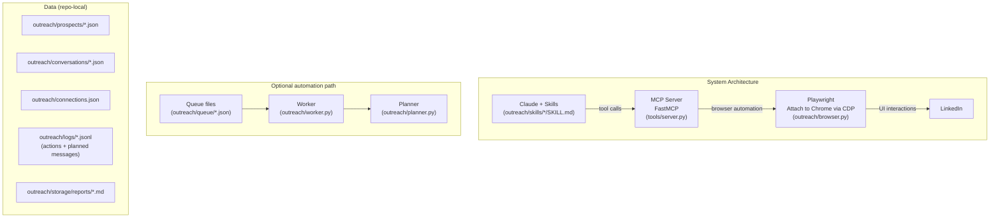
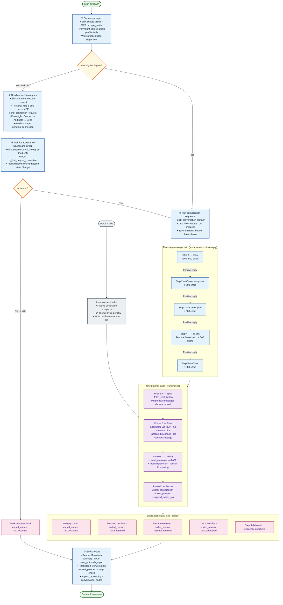

# Architecture & capabilities

This repo wires Claude (via the MCP protocol) to a real LinkedIn session and a small set of repo-local JSON/JSONL files that act as the pipeline state.

## Components

- A **LinkedIn MCP server** (`tools/server.py`) that exposes LinkedIn actions as tools. Playwright attaches to a real Chrome session via CDP.
- A **queue-draining worker** (`outreach/worker.py`) for "run jobs from JSON queue files" automation.
- A **message planner** (`outreach/planner.py`) that can generate copy in **API mode** (Anthropic) or **stub mode** (offline).
- Claude **skills** under `outreach/skills/` that orchestrate end-to-end outreach using MCP tools (including **`setup-outreach`** for first-run profile configuration).

## What you can do

- **First-run setup**
  - Skill: **`setup-outreach`** — interactive wizard: **`scrape_profile`** → present draft persona → refine with operator → **`merge_conversation_planner_identity`**

- **Profile data**
  - `scrape_profile`: quick structured scrape (includes `recent_posts` and also captures `raw_text`)
  - `parse_profile`: deeper multi-page crawl with a **structured** output (`linkedin.parse_profile/v2`) and activity metrics (no raw page dump)
- **Connection + messaging**
  - `send_connection_request` (optional ≤300 char note)
  - `is_first_degree_connection` (used to promote pending → connected)
  - `fetch_chat_history`
  - `send_message`
- **Content / engagement**
  - `create_new_post`
  - `reply_to_post`
  - `browse_forever` (background "human-like" feed browsing)
- **Outreach persistence (server-managed filesystem I/O)**
  - `get_*`, `upsert_*`, `append_*`, `save_connection`, `save_outreach_report`, `remove_pending_queue_entry`

## High-level architecture

## Detailed workflow

