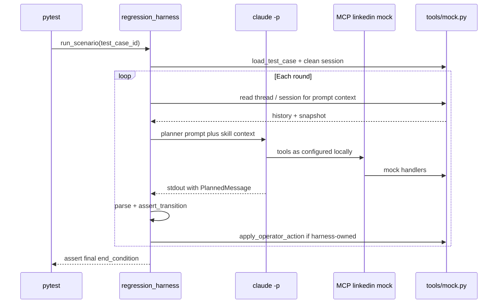

# Design: Local Pytest Regression — Claude CLI × Mock Target

Generated on 2026-05-13  
Branch: main  
Repo: embeddingvc/ebase  
Status: DRAFT (implementation not started)  
Related: [`docs/designs/team-rollout-design.md`](team-rollout-design.md)

## Problem Statement

We need confidence that the **conversation-planner** skill, together with **MCP tools** and **`tools/mock.py`** scripted prospect behavior, still implements the correct **outreach state machine** after changes to skills, server dispatch, or mock data.

**MVP scope:** a **local-only** regression loop. The operator already has **Claude Code**, the **Claude CLI** (`claude`), **MCP** (`tools/server.py` in mock mode), and **skills** installed on disk (`./install.sh` / project skills). The suite should exercise **that same stack**—not a substitute HTTP client to Anthropic, and **not** optimized for headless CI in v1. **`pytest`** is the driver for structure, parametrization, and assertions; **Claude is the planner LLM** each round via **`claude -p`** (subprocess), so tool use and skill behavior match real usage.

## Core Idea (Product Shape)

| Piece | Responsibility |
|--------|------------------|
| **`pytest`** | Local entry point: parametrized scenarios (`happy_path`, `not_interested`, …); collects failures with round index, rule id, expected vs actual |
| **Regression harness** | Load mock case → loop rounds → build planner prompt → **`subprocess`: `claude -p …`** → parse `PlannedMessage` from stdout → **assert transition** → apply operator side-effects via **`tools/mock`** handlers (or rely on CLI-invoked MCP where applicable—see Open Questions) |
| **Claude CLI** | **MVP LLM:** each round’s planning is a real `claude -p` invocation with repo cwd, permission mode, and access to the same MCP + skills as interactive Claude Code |
| **`tools/mock.py`** | **Target simulation:** scripted prospect, `MockSession`, `handle_load_test_case`, `fetch_chat_history`, `send_*` |
| **Transition spec** | Per round: `allowed_actions[]`, stage constraints, mock invariants, terminal rules |

## Demand Evidence

- Teammates and the builder run **Claude Code + MCP + skills locally**; regression should validate **that** path, not a stripped-down API-only stub.
- `tools/mock.py` supplies a **deterministic target** so LinkedIn stays out of scope while still exercising multi-turn flows.
- `pytest` gives repeatable scenarios and rich failure output without building a web UI.

## Status Quo

| Asset | Today |
|--------|--------|
| `tools/mock.py` | `TEST_CASES`, `MockSession`, scripted `replies[]` |
| `outreach/skills/conversation-planner/SKILL.md` | `PlannedMessage` contract |
| `tests/test_conversation_planner.py` | Anthropic **HTTP** API + fixtures (useful reference for parsing, not the MVP stack) |
| `install.sh` | Installs MCP + skills for local Claude |

**Missing:** a **harness** that loops rounds, calls **`claude -p`**, enforces **transition specs**, and pytest modules that **require local tooling** (documented, skipped with a clear message if `claude` missing).

## Target User

**Primary:** a developer on their **Mac** who has run `./install.sh` (or equivalent), has **`claude` on `PATH`**, MCP registered, mock mode on, and runs e.g. `uv run pytest tests/test_regression_workflow.py` before pushing.

**Non-goal (MVP):** green **GitHub Actions** (or any CI) without `claude` and full local config. CI automation can be a **later** phase if the team wants mocked planner output or a self-hosted runner with Claude installed.

## Constraints

- **Local only (MVP):** assume `claude` CLI, auth, and MCP config present; otherwise tests **skip** or **xfail** with an explicit reason (team choice: prefer `pytest.skip` with install instructions).
- **Mock LinkedIn only:** no Playwright, no live LinkedIn; `tools/mock.py` is the prospect.
- **Transition enforcement** still must not rely on free-text quality alone: assert **`action` / `stage` / mock invariants** each round.
- **Isolation:** clean `mock.sessions` per test; avoid writing real operator `outreach/prospects/` unless using `tmp_path` / env override (align with team rollout gitignore).

## Observable State Model (for Assertions)

Same three views as before:

1. **Planner output** — parsed `PlannedMessage` from **`claude -p` stdout** (robust JSON extraction, as in `test_conversation_planner.py`).
2. **Mock session** — snapshot after each round (history length, flags, attachments).
3. **Filesystem (optional later)** — if the harness expects `upsert_*` via MCP during the CLI run.

On failure: **`pytest.fail`** / custom exception with **rule id**, round index, truncated stdout.

## Recommended Architecture

### 1. Harness module

`outreach/regression_harness.py` (path TBD):

- `load_scenario(test_case_id, profile_url)` — reset and load mock case.
- `build_round_prompt(round_context) -> str` — `SKILL.md` excerpt + conversation state from mock/fixtures + instructions to emit **only** `PlannedMessage` JSON (or agreed delimited format).
- **`invoke_claude_cli(prompt: str) -> str`** — `subprocess.run(["claude", "-p", ...], cwd=REPO_ROOT, timeout=…, env=…)`. Reuse patterns from `web/server.py` (`PATH`, timeout env var) where sensible.
- `parse_planned_message(stdout: str) -> PlannedMessage`.
- `apply_operator_action(plan)` — if the MVP assumes **Claude already called MCP** inside `claude -p`, this may be a **no-op** or a **sync** step that only re-reads mock state; if the MVP assumes **harness applies** actions by calling `tools.mock` directly after parsing the plan, document one chosen model (see Open Questions).
- `assert_transition(spec_row, plan, mock_snapshot)`.

### 2. Pytest layer

- `tests/test_regression_workflow.py`: `@pytest.mark.parametrize("case_id", [...])` calling `run_scenario(case_id)`.
- **`pytestmark` or module docstring:** “Local regression — requires `claude` + MCP; not run in default CI.”
- Optional: `@pytest.mark.local_regression` so `pytest -m "not local_regression"` can be used if someone wires a minimal CI job later.

### 3. Transition specs

Versioned with code; update in the same PR as `TEST_CASES` when turn semantics change.

### 4. Out of scope (MVP)

- Web UI as test driver.
- **Anthropic API** as the planner for this suite (keep `test_conversation_planner.py` as a separate, API-based check if desired).
- CI without Claude CLI unless/until a follow-up design adds a **mock-LLM** tier.

## Approaches Considered

### A — Pytest + `claude -p` per round (CHOSEN for MVP)

- **Pros:** Matches installed skills + MCP; highest fidelity to real operator workflow.  
- **Cons:** Slower, flaky if model wording drifts (mitigate with action/stage assertions, not prose); not CI-portable without extra work.

### B — Pytest + Anthropic API only

- **Cons:** Does not use local skills/MCP the same way — **not** the MVP.

### C — Mocked LLM for speed

- **Pros:** CI-friendly.  
- **Cons:** Explicitly **post-MVP**; does not validate Claude + tool wiring.

## Implementation Checklist (in order)

### Phase 0 — Contracts

- [ ] Document `PlannedMessage` fields used for assertions (`conversation-planner/SKILL.md`).
- [ ] Document **local prerequisites:** `claude --version`, MCP `linkedin` registered, mock mode default, skills path.
- [ ] Colocate transition specs (Python dicts recommended).

### Phase 1 — Harness + Claude CLI + two scenarios

- [ ] Implement harness with **`invoke_claude_cli`** and subprocess env (`cwd`, `timeout`, `PATH`).
- [ ] Transition specs for `happy_path` and `not_interested`.
- [ ] Pytest: `run_scenario` for both; **skip** if `claude` not found (with message pointing to install docs).

### Phase 2 — Remaining `TEST_CASES`

- [ ] `no_reply`, `ghosted_cold`, `eager_referral` specs + parametrized tests.

### Phase 3 — Ergonomics

- [ ] `make test-regression-local` (or similar) that runs only this module / marker.
- [ ] Verbose logging: per-round prompt hash (optional), stdout length, transition rule id on pass.

### Phase 4 — Future (explicit deferral)

- [ ] Optional **mocked planner** tier for CI (no `claude` binary).
- [ ] Optional self-hosted runner with `claude` for automated regression.

## Error Handling

- **Missing `claude`:** `pytest.skip` with one-line fix (`brew` / `install.sh` pointer).
- **Parse failure:** include tail of stdout in failure message; round index mandatory.
- **Timeout:** configurable `REGRESSION_CLAUDE_TIMEOUT_SEC`; fail with round index.
- **Non-deterministic model:** transition specs should be **sets of allowed actions** where possible, not a single brittle string match on message body.

## Open Questions

- **Who applies operator actions after each round?** (a) Claude subprocess calls MCP tools end-to-end each round, and the harness only asserts state + parses final assistant JSON; (b) harness parses `PlannedMessage` and calls `tools.mock` handlers itself (faster, but may diverge from “real” tool paths). MVP should pick **one** and document it.
- **Single `claude -p` per round vs one long session:** per-round subprocesses are simpler and match “fresh planner read” semantics; document tradeoff.
- **Permission mode:** default `dontAsk` vs `acceptEdits` for regression—must match what allows MCP tool use in non-interactive runs.

## Resolved Questions

- **LLM for MVP:** **Claude CLI** (`claude -p`), local only.
- **CI:** **Not** the MVP goal; local machine + installed tools/skills is.
- **Target:** **`tools/mock.py`**.
- **Correctness:** **Transition assertions** each round.

## Success Criteria

- On a **fully configured dev machine**, `make test-regression-local` (or equivalent) completes **`happy_path`** with all transition checks green and mock `end_condition` satisfied.
- Intentional mock or spec drift produces a **failing test** with **rule id** and round number.
- On a machine **without** `claude`, the suite **skips** with a clear message (no false greens from empty passes).

## NOT in scope (MVP)

- GitHub Actions / cloud CI for this suite without additional design.
- Web UI test dashboard.
- Live LinkedIn / Playwright.

## CEO Review Decisions (proposed)

| # | Decision | Choice | Reasoning |
|---|----------|--------|-----------|
| D1 | Entry point | **`pytest` locally** | Structured scenarios and assertions |
| D2 | Planner LLM (MVP) | **`claude -p`** | Same stack as skills + MCP on disk |
| D3 | Target | `tools/mock.py` | Safe, deterministic prospect |
| D4 | Correctness | **Transition specs** per round | Reduces reliance on prose |
| D5 | CI | **Out of scope for MVP** | Avoid false promise; add mocked tier later if needed |

## The Assignment

Implement **Phase 0–1**: harness, `claude -p` invocation, transition specs for two cases, pytest with skip-if-no-cli. Expand to all `TEST_CASES` in **Phase 2**; polish **Phase 3**.

## Tiered Pyramid (reframed for this design)

| Tier | Role |
|------|------|
| 0 | Unit helpers: URL normalisation, parse `PlannedMessage` from noisy stdout (no `claude` call) |
| 1 | **MVP:** pytest + harness + **`claude -p`** + mock target + transition specs — **local only** |
| 2 | Optional: `pytest-html` or verbose logs for sharing failure artifacts |
| 3 | **Future:** mocked planner or hosted runner for CI |
| 4 | `test_conversation_planner.py` (API path) — separate concern |
| 5 | Playwright exploration — manual |
