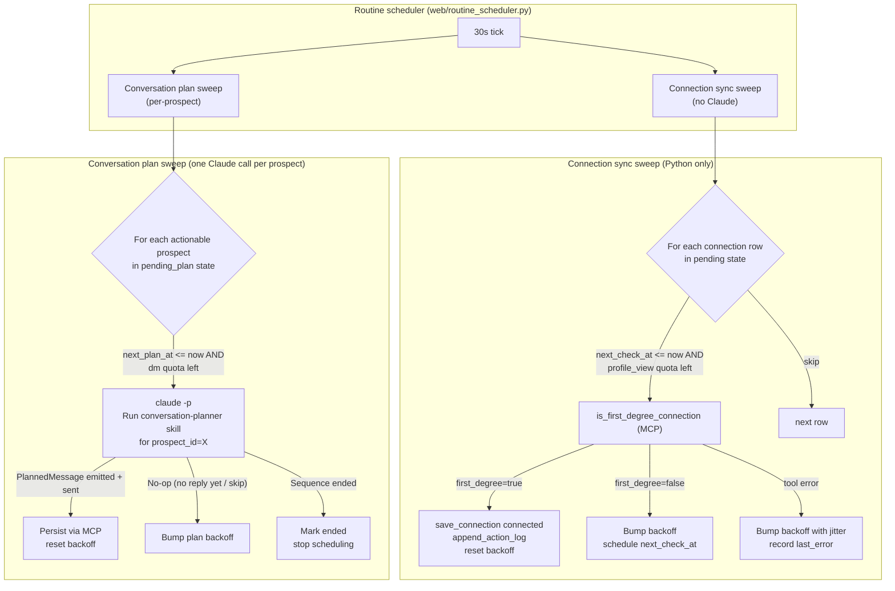

# Design: Per-Connection Routines with Adaptive Backoff

Generated on 2026-05-28
Branch: main
Repo: embeddingvc/ebase
Status: DRAFT (implementation not started)
Related:
- [`docs/designs/team-rollout-design.md`](team-rollout-design.md)
- [`docs/designs/outreach-workflow-regression-tests-design.md`](outreach-workflow-regression-tests-design.md)
- [`.claude/skills/conversation-planner/SKILL.md`](../../.claude/skills/conversation-planner/SKILL.md) (installed copy)
- [`.claude/skills/sync-pending-connections/SKILL.md`](../../.claude/skills/sync-pending-connections/SKILL.md) (installed copy)
- [`web/routine_scheduler.py`](../../web/routine_scheduler.py)
- [`web/routines_config.py`](../../web/routines_config.py)
- [`web/skill_runner.py`](../../web/skill_runner.py)
- [`tools/rate_limits.py`](../../tools/rate_limits.py)

## Problem Statement

The dashboard routines today are **two big `claude -p` calls that fan out internally**:

| Routine | Skill | What runs |
|---------|-------|-----------|
| `sync_pending` | `sync-pending-connections` | One Claude call walks every `connection_status: "pending"` row, calls `is_first_degree_connection` per row, and `save_connection` on promotion. |
| `conversation_planner` | `conversation-planner` (batch mode) | One Claude call walks every `connected` / `engaged` row, runs Phase A → D per prospect, decides whether to send a message. |

Two problems compound:

1. **Context-window dilution.** Each Claude call carries the full `SKILL.md`, all connection rows, prior tool results, and tool definitions for every prospect in the batch. As the connection list grows, the per-prospect signal gets buried, the model spends tokens reasoning across unrelated rows, and quality drops in exactly the way Anthropic warns about for long-context tool loops. Looking at recent runs, even with **one** pending connection the planner re-emits batch-summary boilerplate every 30 minutes and occasionally hallucinates next steps that the operator never asked for (see `outreach/logs/routine_runs.jsonl`, May 24–28).
2. **No-op LLM spend.** `sync-pending-connections` is a deterministic loop — read JSON, hit one MCP tool per row, write JSON. There is no judgement step that requires an LLM, yet every tick pays for a fresh Claude planning pass plus the model's habit of writing a 200-word summary about why nothing changed. Failure modes are mostly API connection drops, not planning errors.

The user proposal:

- **Demote `sync_pending` to a plain periodic Python task** (no `claude -p`) that calls MCP tools directly.
- **Promote `conversation_planner` to a per-prospect Claude invocation**, one prospect's full context per call, scheduled with **exponential backoff + rate limiting** so we never need to fan out 50 prospects on the same minute.
- Realtime is **not** a requirement. A prospect waiting 6 hours for our next message is normal LinkedIn cadence.

The two checks (is-this-pending-accepted? vs. plan-next-message?) can have **independent initial intervals and backoff curves**, because they have different costs and different signal value.

## Demand Evidence

- `outreach/logs/routine_runs.jsonl` shows ~30 successive `sync_pending` runs over 4 days, every one of them reporting **"still pending: 1 (Ariharan S)"** for the same row. Each run spent a `claude -p` subprocess (~12–25 s, plus tokens) to discover nothing changed. Several failed mid-run with `API Error: Unable to connect to API` — purely infrastructural, not planning errors.
- `conversation-planner` batch mode in those same runs always returns the same "no actionable prospects" summary because the only row is still pending. The LLM is being asked to redraw the same skip-decision every 30 minutes.
- The web dashboard already exposes per-routine `interval_minutes` and `active_window_*`, but there is no per-row backoff state, so the routines cannot "ease off" rows that just answered "no change."
- `tools/rate_limits.py` already meters `connection_request`, `dm`, and `profile_view` per day. `is_first_degree_connection` consumes a `profile_view` quota, so unchecked fan-out can exhaust the daily cap mid-morning and starve the rest of the routines.

## Status Quo

| Asset | Today |
|-------|-------|
| `web/routine_scheduler.py` | One asyncio loop, ticks every 30 s, runs `run_named_skill(skill)` when `interval_minutes` has elapsed. One routine row = one skill = one `claude -p`. |
| `web/skill_runner.py` | `run_named_skill` shells out to `claude -p "Run {skill} skill"`; no per-prospect args. |
| `web/routines_config.py` | Stores routines flat in `dashboard_routines.json`. Only knobs: `interval_minutes`, `active_window_start/end`, `active`. |
| `.claude/skills/sync-pending-connections/SKILL.md` | Skill prose tells the LLM to iterate pending rows and call MCP tools. There's already a half-built `sync.py` next to it that does the same thing in pure Python (it `import`s a `claude_code_tools` module that doesn't exist in this repo). |
| `.claude/skills/conversation-planner/SKILL.md` | Skill has an explicit **Batch Mode** section: load `get_connections`, filter actionable, loop. All inside one Claude call. |
| `tools/rate_limits.py` | Per-day caps: connection_requests=1, dms=3, profile_views=10 (defaults; overridable). Resets at local midnight. **No per-prospect throttle.** |
| `outreach/connections.json` | Flat list, each row has `connection_status` (`none` | `pending` | `connected` | `ended`) but **no last-checked / next-check timestamps**. |

**Missing:**
- A per-prospect scheduling state (when to next probe `is_first_degree_connection`, when to next ask the LLM to plan).
- A scheduler tier that can fan out *one prospect at a time* and gate fan-out by daily rate limits.
- A way to run `sync-pending-connections` semantics **without** invoking Claude.

## Target Behavior (Product Shape)



| Piece | Responsibility |
|-------|----------------|
| **Connection sync sweep** | Pure Python task in `web/routine_scheduler.py`. Reads `connections.json` via MCP server helpers (in-process import, no subprocess), filters `pending` rows whose `next_check_at` is past, calls `is_first_degree_connection`, flips status, advances per-row backoff. **No LLM.** |
| **Conversation plan sweep** | One `claude -p` per actionable prospect. Prompt is **`Run conversation-planner skill with prospect_id="<id>"`** — single-prospect mode, which the skill already supports (see SKILL.md `Inputs`). |
| **Per-prospect scheduling state** | New fields on each connection row (or a sidecar file): `sync_backoff` (current interval + last result + next_check_at) and `plan_backoff` (same shape). Persisted under the existing connection row so it survives restarts. |
| **Rate-limit-aware fan-out** | Sweep stops issuing actions when `rate_limit(...)` for the relevant request type would deny. Backoff timers stay armed; the next tick re-checks. |
| **Dashboard configuration** | Replace flat `interval_minutes` with two pairs of knobs (`sync_initial_interval`, `sync_backoff_multiplier`, `plan_initial_interval`, `plan_backoff_multiplier`). Existing routine rows migrate to a sensible default. |

## Approaches Considered

### A — Per-prospect Claude calls + deterministic sync sweep (CHOSEN)

Move `sync-pending-connections` into Python; keep `conversation-planner` as Claude but invoke it once per prospect with per-prospect backoff.

- **Pros:**
  - Smallest possible context window per LLM call → measurably better planning quality.
  - Eliminates LLM token cost for the no-op sync flow (currently the majority of runs).
  - Native per-prospect cadence: a hot prospect can be replanned every 30 min, a cold one only once a day.
  - Plays well with `tools/rate_limits.py` — the sweep decides *which* prospect to act on under a shared daily cap.
- **Cons:**
  - Adds per-row state (more file writes, more migration surface).
  - Concurrency-by-prospect needs care: must serialize per-prospect Claude calls so two parallel runs don't double-send.
  - Loses the "I checked everything in one pass" mental model that the current single Claude run gives the operator.

### B — Keep skill-based loops, add per-row "skip if unchanged" logic inside the skill

Tell the skill via prompt to remember `last_check_at` and skip rows checked recently.

- **Pros:** Smallest diff.
- **Cons:** Still pays one big LLM call per tick. The model decides cadence, which is unreliable and expensive to evolve. Does nothing for context-window dilution.

### C — Drop the LLM entirely (planner becomes pure Python templates)

Use `outreach/planner.py`'s stub mode for every send.

- **Pros:** Cheapest, most deterministic.
- **Cons:** Loses the personalization quality that justified Claude in the first place. Already deprecated by the conversation-planner skill direction. **Out of scope.**

## Recommended Architecture

### 1. Per-row scheduling state

Extend each `connections.json` row with two backoff records. (Could also live in a sidecar `outreach/storage/routine_state/<prospect_id>.json` if we want to keep `connections.json` clean; see [Open Questions](#open-questions).)

```jsonc
{
  "prospect_id": "jane_doe_example",
  "profile_url": "https://www.linkedin.com/in/jane-doe-example/",
  "name": "Jane Doe",
  "title": "Software Engineer",
  "connection_status": "pending",
  "connected_at": "2026-05-24T05:31:48.050685+00:00",
  "note_sent": null,

  "sync_backoff": {
    "current_interval_minutes": 240,
    "consecutive_no_change": 6,
    "last_check_at": "2026-05-28T20:12:54Z",
    "next_check_at": "2026-05-29T00:12:54Z",
    "last_result": "still_pending",
    "last_error": null
  },
  "plan_backoff": {
    "current_interval_minutes": 60,
    "consecutive_no_action": 2,
    "last_run_at": "2026-05-28T20:12:53Z",
    "next_plan_at": "2026-05-28T21:12:53Z",
    "last_planned_action": null
  }
}
```

Both backoff objects are nullable; absence means "use defaults from routine config."

### 2. Backoff curves

A simple multiplicative-with-cap policy keeps the math (and the dashboard explanation) sane.

| Curve | Default initial | Default multiplier | Default max | Reset trigger |
|-------|-----------------|--------------------|-------------|---------------|
| `sync_backoff` (connection acceptance check) | 30 min | ×1.5 per "still_pending" | 24 h | `first_degree=true` → row becomes `connected`, backoff record deleted. |
| `plan_backoff` (conversation planning) | 60 min | ×2.0 per "no_action" (skip / no reply yet) | 12 h | A prospect message arrives or a planned message is sent. |
| Tool error (either curve) | unchanged | ×2.0 with ±20% jitter | 6 h | Next successful call resets to current_interval. |

Pseudocode (Python):

```python
def next_interval(prev: int, multiplier: float, max_min: int, jitter: bool = False) -> int:
    nxt = max(1, int(prev * multiplier))
    if jitter:
        nxt = int(nxt * random.uniform(0.8, 1.2))
    return min(nxt, max_min)
```

All four numbers (initial, multiplier, max, jitter on/off) are surfaced as routine-row config so the operator can tune from the dashboard without code changes.

### 3. New scheduler shape

`web/routine_scheduler.py` keeps its 30 s tick but the inner work splits:

```python
async def _tick() -> None:
    cfg = routines_config.load_config()
    if cfg["sync_routine"]["active"]:
        await _run_sync_sweep(cfg["sync_routine"])
    if cfg["plan_routine"]["active"]:
        await _run_plan_sweep(cfg["plan_routine"])

async def _run_sync_sweep(rcfg: dict) -> None:
    rows = filesystem.get_connections()["connections"]
    for row in rows:
        if row.get("connection_status") != "pending":
            continue
        if not _due(row.get("sync_backoff"), now=utcnow()):
            continue
        if rate_limits.rate_limit("profile_view", record=False) is not None:
            break  # daily cap hit; bail out of sweep for the day
        result = await mcp.is_first_degree_connection(row["profile_url"])
        _apply_sync_result(row, result, rcfg)         # mutate row + backoff
        filesystem.save_connection(...)

async def _run_plan_sweep(rcfg: dict) -> None:
    rows = filesystem.get_connections()["connections"]
    for row in _actionable_for_planning(rows):
        if not _due(row.get("plan_backoff"), now=utcnow()):
            continue
        if rate_limits.rate_limit("dm", record=False) is not None:
            break
        result = await asyncio.to_thread(
            skill_runner.run_skill_prompt,
            f'Run conversation-planner skill with prospect_id="{row["prospect_id"]}".',
        )
        _apply_plan_result(row, result, rcfg)
```

Key properties:

- **Per-prospect serialization.** Each prospect row uses a `prospect_id → asyncio.Lock` (mirroring the existing `_running_locks` pattern), so a long Claude call cannot stack on itself for the same prospect.
- **Daily-cap-aware bail-out.** Sweeps stop *issuing* actions once the relevant rate-limit category is exhausted; backoff state is **not** advanced for skipped rows, so they reattempt naturally tomorrow.
- **One sweep = at most one outbound LinkedIn action per prospect.** Same single-touch invariant the skill already promises.

### 4. Dashboard config migration

`web/routines_config.py` currently stores routines like:

```json
{ "id": "sync_pending", "skill": "sync-pending-connections", "interval_minutes": 30, ... }
{ "id": "conversation_planner", "skill": "conversation-planner", "interval_minutes": 30, ... }
```

After migration we keep two rows but their meaning changes:

```jsonc
{
  "id": "sync_pending",
  "name": "Sync Pending Connections",
  "kind": "connection_sync",        // new: typed routine, not a skill name
  "active": true,
  "active_window_start": "09:00",
  "active_window_end": "17:00",
  "tick_seconds": 30,
  "backoff": {
    "initial_minutes": 30,
    "multiplier": 1.5,
    "max_minutes": 1440,
    "error_jitter": true
  }
}
{
  "id": "conversation_planner",
  "name": "Conversation Planner",
  "kind": "conversation_plan",      // dispatches per-prospect claude -p
  "active": true,
  "active_window_start": "09:00",
  "active_window_end": "17:00",
  "tick_seconds": 30,
  "backoff": {
    "initial_minutes": 60,
    "multiplier": 2.0,
    "max_minutes": 720,
    "error_jitter": true
  }
}
```

`web/skill_runner.py.ALLOWED_SKILLS` keeps its existing entries so single-prospect ad-hoc skill invocations (and `/send-connection-request`, `/reply-to-post`) still work — only the *scheduler* path moves off the loop-skill model.

### 5. Updated skills

- **`.claude/skills/sync-pending-connections/SKILL.md`** — keep the skill so a human operator can still type "sync pending connections" in Claude Code, but add a banner: *"In automated routines this work is performed by `web.routine_scheduler._run_sync_sweep` without an LLM. Use this skill for ad-hoc or troubleshooting runs only."*
- **`.claude/skills/conversation-planner/SKILL.md`** — drop the Batch Mode section (or move it to an appendix labelled "manual operator use only"), because batch mode is now driven externally by per-prospect dispatches. Single-prospect mode becomes the supported automated path.

### 6. MCP / library surface

No new MCP tools. The sweep uses existing tools from `tools/server.py` via in-process imports of the same handlers (the dashboard process and the MCP server already share the codebase). Concretely:

- `outreach.storage.get_connections()` (helper used by the MCP tool of the same name)
- `outreach.browser.LinkedInBrowser.is_first_degree_connection` via a thin async wrapper, **respecting rate_limits.rate_limit("profile_view", ...)** identically to the MCP tool.
- `outreach.storage.save_connection(...)`, `append_action_log(...)`.

`claude -p` is invoked exactly as today via `web.skill_runner.run_skill_prompt`, only the prompt template changes (single prospect, not "Run skill").

### 7. Observability

- `outreach/logs/routine_runs.jsonl` keeps one row per **sweep**, plus one extra row per **prospect action** with `kind="sync_action"` or `kind="plan_action"`, including `prospect_id`, `result` (`promoted` / `still_pending` / `error` / `planned` / `sent` / `ended` / `skipped_rate_limited`), and the new `next_check_at`.
- Dashboard gains a per-row "next check" / "next plan" timestamp so the operator can see why a connection isn't being re-probed.
- Failed `claude -p` calls (currently overwhelm the runs log with the same `ConnectionRefused` line) carry the failing prospect_id, so debugging becomes a per-prospect grep.

## Implementation Checklist (in order)

### Phase 0 — Contracts

- [ ] Document `sync_backoff` and `plan_backoff` field shapes on `outreach/schemas/prospect.schema.json` (or a new `routine_state.schema.json`) and decide inline-row vs sidecar (see Open Questions).
- [ ] Decide and write down the per-routine config shape used by `web/routines_config.py`.
- [ ] Add a migration block in `web/routines_config._migrate_routines` so existing `dashboard_routines.json` files upgrade silently.

### Phase 1 — Deterministic sync sweep

- [ ] Implement `_run_sync_sweep` in `web/routine_scheduler.py` using direct calls to MCP-server-internal helpers (no `claude -p`, no subprocess).
- [ ] Implement `next_interval` helper with jitter.
- [ ] Rate-limit-aware bail-out using `tools.rate_limits.rate_limit("profile_view", record=True)`.
- [ ] Unit tests on the backoff math (`tests/test_routine_backoff.py`) and integration test against mock mode of `is_first_degree_connection`.

### Phase 2 — Per-prospect planner sweep

- [ ] Implement `_run_plan_sweep` that fans out `claude -p` calls one prospect at a time with per-prospect `asyncio.Lock`.
- [ ] Update `web/skill_runner.run_skill_prompt` so it can accept an explicit prospect_id parameter and rendered prompt; keep the legacy `run_named_skill` for ad-hoc skill runs.
- [ ] Per-prospect logging into `outreach/logs/routine_runs.jsonl`.

### Phase 3 — Skill text + dashboard updates

- [ ] Edit installed copies of both SKILL.md files with the "automation lives in scheduler" banner.
- [ ] Update dashboard UI to expose per-routine backoff config (Configure modal already accepts arbitrary fields; need to render four inputs).
- [ ] README and `docs/web-dashboard.md` updates.

### Phase 4 — Cleanup

- [ ] Remove `.claude/skills/sync-pending-connections/sync.py` (the stub that imports the non-existent `claude_code_tools`).
- [ ] Drop `sync-pending-connections` from `web.skill_runner.ALLOWED_SKILLS` if we want to forbid the dashboard scheduler from ever running it as a Claude skill (leave it installed for human use in Claude Code).
- [ ] Mark batch-mode behaviour in `conversation-planner` SKILL.md as "manual operator only."

### Phase 5 — Optional follow-ups (explicit deferral)

- [ ] Per-account daily caps for multi-tenant team rollout (links into [`team-rollout-design.md`](team-rollout-design.md)).
- [ ] Adaptive multiplier learning ("if a prospect always replies within 24h, lower the plan_backoff multiplier for them") — almost certainly premature; revisit only with real volume.
- [ ] Pull-the-cord button on dashboard: "force plan now for prospect X" overrides `next_plan_at`.

## Error Handling & Recovery

- **`is_first_degree_connection` raises (browser disconnected, LinkedIn 429):** mark `sync_backoff.last_error`, apply error curve (×2 with jitter), do not advance `connection_status`. Sweep continues with the next row.
- **`claude -p` fails (API outage, currently visible in May 25–27 logs):** mark `plan_backoff.last_error`, do **not** advance `connection_status` or `outreach_stage`. Sweep continues. Today this same failure mode taints the entire run for every prospect — the new design isolates it.
- **Rate limit reached mid-sweep:** stop issuing new actions of that type, but keep iterating to update unaffected rows (e.g., `dm` cap hit ≠ `profile_view` cap hit). No backoff bumps for skipped rows.
- **Concurrent dashboard "run now" click:** dashboard route must take the same per-prospect lock the scheduler uses, or the click is rejected with `{"ok": false, "error": "prospect already being processed"}`.
- **Schema migration safety:** a missing `sync_backoff` block means "use defaults"; corrupt JSON re-initialises to defaults rather than failing the whole sweep (mirrors `_coerce_time_str_silent` philosophy in `web/routines_config.py`).

## Open Questions

- **Where does per-prospect backoff state live?** Inline on `connections.json` rows is simpler and survives existing `save_connection` writes, but makes the file noisier and races with hand edits. A sidecar `outreach/storage/routine_state/<prospect_id>.json` is cleaner but doubles the writes per sweep. Recommend inline for v1, revisit if hand-editing causes pain.
- **Do we keep `sync-pending-connections` installed at all?** It is genuinely useful when a human asks "did anyone accept?" in Claude Code. Keeping it installed but excluding it from the scheduler's allow-list is the safest middle ground.
- **Backoff units.** Minutes are easy to reason about on the dashboard, but if we later want sub-minute polling for a "hot" prospect (Step 5 close just sent), we may want seconds. Defer the change until we have evidence.
- **Active window interplay.** Today routines respect a single `active_window_start/end`. With per-prospect backoff a prospect's `next_check_at` may fall outside the window; should we (a) reschedule forward to next window-open, or (b) silently drop the tick? (a) is friendlier; document the choice.
- **Mock-mode parity.** Regression harness ([`outreach-workflow-regression-tests-design.md`](outreach-workflow-regression-tests-design.md)) drives single-prospect Claude calls already; the new per-prospect scheduler is in fact closer to how tests run today, which is a nice convergence. Need explicit tests that mock-mode `is_first_degree_connection` plays well with the new backoff curve.

## Resolved Questions

- **Is realtime required?** No. The operator has confirmed delayed response (hours, even a day) is acceptable for prospect replies, because LinkedIn cadence is already slow.
- **Per-prospect Claude call vs. one batched call?** Per-prospect — the context-window argument outweighs the marginal scheduler complexity, and the skill already supports `prospect_id` input.
- **Should the sync sweep ever call Claude?** No. Every step the sync skill performs is deterministic; the LLM only added latency, cost, and a chatty summary.

## Success Criteria

- **Zero LLM tokens spent on no-change sync passes.** `outreach/logs/routine_runs.jsonl` rows of kind `sync_action` carry no `stdout_tail` from `claude -p`.
- **Conversation-planner runs touch one prospect each.** Every `plan_action` row in the log carries exactly one `prospect_id`, and the `claude -p` prompt body contains no other prospect ids.
- **Backoff visibly stretches in steady state.** For a prospect that has been pending for two days, `next_check_at` lands ≥ 24 h after `last_check_at` (capped at the configured max), instead of every 30 minutes today.
- **No regression in send fidelity.** On the existing regression scenarios (`happy_path`, `not_interested`, …) the new per-prospect path produces the same terminal outcomes as the current batch mode.
- **Rate-limit safety preserved.** Daily caps from `tools/rate_limits.py` are still respected: no run exceeds the configured `profile_view` / `dm` / `connection_request` totals even under a 100-row test list.

## NOT in scope

- Web UI to view per-prospect backoff history (timestamps surface in the dashboard, but no chart).
- Multi-account fan-out for the team rollout — that is a separate design.
- Adaptive backoff that learns from prospect reply patterns.
- Replacing the conversation-planner SKILL itself; only how it is **invoked** changes.

## The Assignment

Land **Phase 0–2** behind a feature flag in `web/routines_config.py` (`scheduler_kind: "loop" | "per_prospect"`, default `"loop"`) so the new path can be A/B'd against the current behaviour on the same machine. Run both for a week on the live connections list and compare:

1. Total `claude -p` invocations per day.
2. Total `profile_view` quota consumed per day.
3. Operator-perceived freshness (how stale is a `pending` row that did actually get accepted?).

If the per-prospect path wins on (1) and (2) without losing (3), make it the default and remove the loop path in a follow-up PR.
