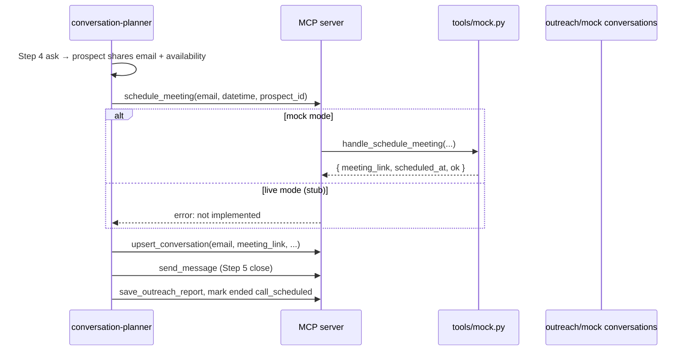

# Design: Schedule Meeting MCP Tool, Skill Wiring, and Regression Tests

Generated on 2026-05-17  
Branch: main  
Repo: huangruoqi/LinkedIn-Outreach  
Status: DRAFT (implementation not started)  
Related:
- [`docs/designs/outreach-workflow-regression-tests-design.md`](outreach-workflow-regression-tests-design.md)
- [`outreach/skills/conversation-planner/SKILL.md`](../../outreach/skills/conversation-planner/SKILL.md)
- [`tests/test_regression_workflow.py`](../tests/test_regression_workflow.py)

## Problem Statement

The conversation planner already steers **`end_goal: schedule_meeting`** threads toward an email/call ask (Step 4) and a close with **`ended_reason: call_scheduled`** (Step 5), and the conversation schema has **`email`** and **`meeting_link`** fields plus a **`confirm_meeting`** action enum value. There is **no MCP tool** that actually books a calendar hold or returns a meeting URL, so today the planner can only *say* a call is coming — it cannot persist a real (or mock) scheduling outcome in a single, testable step.

We need:

1. An MCP tool **`schedule_meeting`** with **`email`** and **`datetime`** (and enough context to attach results to the right prospect).
2. **Mock** implementation for regression and local dev; a **live stub** when `mock=False` that fails clearly until a real calendar integration exists.
3. **`conversation-planner` skill** updates so the agent calls the tool when it has both email and an agreed time window — not only in closing copy.
4. **`tests/test_regression_workflow.py`** and harness assertions aligned with the mock **`happy_path`** case (`end_condition: meeting_scheduled`).

## Demand Evidence

- Mock case **`happy_path`** in `tools/mock.py` already scripts prospect replies that offer availability and share **`alexchen336@gmail.com`** with “schedule a call next week”, but nothing in the stack records **`meeting_link`** or proves scheduling ran.
- `outreach/regression_harness.py` **`scenario_terminal_satisfied`** still treats **`happy_path`** like a resume outcome (`_prospect_has_resume_in_history`), which contradicts `TEST_CASES["happy_path"]["end_condition"] == "meeting_scheduled"`.
- Schema and planner config already use **`call_scheduled`** / **`confirm_meeting`** — the missing piece is a tool boundary the skill and tests can target.

## Status Quo

| Asset | Today |
|--------|--------|
| `conversation.schema.json` | `email`, `meeting_link`; `next_action` / `last_action` include **`confirm_meeting`** |
| `conversation-planner/SKILL.md` | Step 4 asks for email; Step 5 closes with “intro is coming” when call goal met — **no `schedule_meeting` tool** |
| `tools/server.py` | LinkedIn + outreach filesystem tools only |
| `tools/mock.py` | `happy_path` → `end_condition: meeting_scheduled`; no scheduling handler |
| `tests/test_regression_workflow.py` | Parametrized `happy_path`; relies on harness `REGRESSION_SPECS` |
| `tests/test_conversation_planner.py` | `VALID_ACTIONS` includes **`confirm_meeting`**; no scheduling tool tests |

## Target Behavior (Product Shape)

| Piece | Responsibility |
|--------|----------------|
| **`schedule_meeting` MCP tool** | Given prospect context + `email` + `datetime`, create (mock) or reserve (live, later) a meeting; return JSON with `meeting_link`, normalized `scheduled_at`, and status |
| **`tools/mock.py`** | Deterministic fake link; optionally persist on conversation via server helper or document that skill must `upsert_conversation` |
| **`conversation-planner` skill** | After email + time intent in thread, call **`schedule_meeting`** before Step 5 close; set `email`, `meeting_link`, `last_action` / bookkeeping |
| **Regression harness** | Assert `meeting_link` / `email` on conversation when spec says so; terminal = `ended_reason == call_scheduled` for `happy_path` |
| **Unit tests** | Fast tests for mock handler + server dispatch (no `claude`); extend regression module doc / markers |



## MCP Tool Contract

### Name

`schedule_meeting` (verb-noun, consistent with `send_message`, `send_connection_request`).

### Parameters

| Parameter | Type | Required | Description |
|-----------|------|----------|-------------|
| `email` | string | yes | Prospect email to invite (validate basic shape in server; full RFC optional) |
| `datetime` | string | yes | ISO 8601 UTC **or** operator-agreed natural slot already resolved to ISO (skill must normalize ambiguous “next week” to a concrete instant before calling) |
| `prospect_id` | string | no* | Outreach id (`alex_chen_softeng`). Preferred for filesystem updates. |
| `profile_url` | string | no* | LinkedIn URL; used when `prospect_id` unknown (derive id from connections row if possible) |

\*At least one of `prospect_id` or `profile_url` must be provided so mock/live can attach state to the right thread.

Optional later (not MVP): `duration_minutes`, `timezone`, `title`, `organizer_email`.

### Return value

JSON **string** (same pattern as other tools), e.g.:

```json
{
  "status": "scheduled",
  "meeting_link": "https://meet.example/mock/alex-chen-softeng-20260520T150000Z",
  "scheduled_at": "2026-05-20T15:00:00Z",
  "email": "alexchen336@gmail.com",
  "prospect_id": "alex_chen_softeng"
}
```

On failure: plain-text prefix `error: ...` (match `get_conversation` style) or JSON with `"status": "error"` — **pick one in implementation** and document in skill (recommend JSON for structured parsing).

### Server wiring (`tools/server.py`)

```python
@mcp.tool()
async def schedule_meeting(
    email: str,
    datetime: str,
    prospect_id: str | None = None,
    profile_url: str | None = None,
    cdp_url: str = "http://localhost:9222",
) -> str:
    if _mock_mcp_enabled():
        return await _mock.handle_schedule_meeting(
            email=email,
            datetime=datetime,
            prospect_id=prospect_id,
            profile_url=profile_url,
        )
    return await _schedule_meeting_live(
        email=email,
        datetime=datetime,
        prospect_id=prospect_id,
        profile_url=profile_url,
        cdp_url=cdp_url,
    )
```

### Live stub (`mock=False`)

```python
async def _schedule_meeting_live(...) -> str:
    return (
        "error: schedule_meeting is not implemented in live mode yet. "
        "Use mock mode for regression, or book manually and set meeting_link via upsert_conversation."
    )
```

No Playwright, no Google Calendar API in this design — only a clear stub so the tool is registered and skills fail predictably.

## Mock Implementation (`tools/mock.py`)

### Handler

`handle_schedule_meeting(email, datetime, prospect_id=None, profile_url=None) -> str`

Behavior (MVP):

1. Validate non-empty `email` and parseable `datetime` (ISO); on bad input return `error: invalid datetime` / `error: invalid email`.
2. Resolve `prospect_id` from argument or from active `MockSession` keyed by `profile_url`.
3. Build deterministic link, e.g.  
   `https://mock.calendar.local/{prospect_id}/{slug(datetime)}`  
   so regression assertions are stable.
4. **Persist side effect (recommended):** load `outreach/mock/conversations/<prospect_id>.json` if present, set `email`, `meeting_link`, set `last_action` to `"confirm_meeting"`, `upsert` via same atomic write helper the server uses — **or** return JSON only and require the skill to `upsert_conversation` (see Open Questions).

5. Append a line to mock `actions.jsonl` with `action: schedule_meeting` for debugging.

### Registry

Add to mock module docstring export list; no MCP exposure for `handle_load_test_case` changes required beyond existing `happy_path` replies.

## Skill Updates (`conversation-planner/SKILL.md`)

### When to call `schedule_meeting`

Call **after** both are true:

1. **Email** appears in the merged thread (prospect message or attachment metadata) or is already on `conversation.email`.
2. **Scheduling intent** is clear: prospect agreed to a call/meeting **and** either gave a concrete time **or** the planner has committed to a specific slot in the plan (skill: resolve “next week” / “anytime next week” to a single ISO `datetime` using reasonable defaults, e.g. next Tuesday 15:00 UTC, and mention that time in the closing DM).

Do **not** call before email is known. Do **not** call for `end_goal: obtain_resume` unless config explicitly maps to a call goal.

### Workflow insertion (Step 4 → 5)

Amend **Step 5 — The Close** / **Side Effects**:

| Step | Action |
|------|--------|
| 1 | `schedule_meeting(email=..., datetime=..., prospect_id=...)` |
| 2 | Parse response → set `conversation.email`, `conversation.meeting_link` |
| 3 | `upsert_conversation` |
| 4 | Compose Step 5 close message referencing the link or “calendar invite sent to &lt;email&gt;” |
| 5 | `send_message` (Phase C), then terminal fields + `ended_reason: call_scheduled` + report |

### MCP tools table

Add row:

| Tool | Use |
|------|-----|
| `schedule_meeting` | Book (mock) or reserve a call after email + time are known; persist `meeting_link` on conversation. |

### PlannedMessage / `next_action`

Keep emitting **`confirm_meeting`** as `next_action` when the **next** automation step is “scheduling already done, send close only” **or** when the planner schedules in the same run:

- **Option A (recommended):** Same run: call `schedule_meeting` during planning, then `action: send_followup_message` for close, `ended_reason` set on that PlannedMessage.
- **Option B:** Split runs: PlannedMessage `action: confirm_meeting` with `message: null`; harness/automation calls `schedule_meeting` then a follow-up planner run — more moving parts.

Document **Option A** in the skill as default for mock regression.

### Report template

Under **Outcome → Call**, use scheduled `datetime` and `meeting_link` from conversation, not “Not scheduled”.

## Regression Harness & `tests/test_regression_workflow.py`

### Fix terminal condition for `happy_path`

Replace resume-based check with meeting-based check:

```python
def scenario_terminal_satisfied(case_id: str, session: _mock.MockSession, plan: dict[str, Any]) -> bool:
    ...
    if case_id == "happy_path":
        if plan.get("ended_reason") == "call_scheduled":
            return True
        if plan.get("end_conversation") and plan.get("action") in ("mark_ended", "mark_dead"):
            return True
    ...
```

Optional: read `get_conversation` and require non-null `meeting_link` before accepting terminal.

### Transition specs (`REGRESSION_SPECS`)

Extend **`happy_path`** rounds (names illustrative — tune to observed model behavior):

| Round id | Notes | `allowed_actions` (additions) |
|----------|--------|-------------------------------|
| `hp_r1_step4` | Ask path | unchanged |
| `hp_r2_step5_schedule` | Email captured; scheduling may run inside `claude -p` | allow `confirm_meeting`, `send_followup_message` |
| `hp_r3_step5_close` | Close + end | `send_followup_message`, `mark_ended`; `allowed_stages` includes `ended` |

Add optional post-round hook:

```python
async def assert_meeting_scheduled(mod, prospect_id: str) -> None:
    conv = json.loads(await mod.get_conversation(prospect_id))
    if not conv.get("meeting_link"):
        pytest.fail("expected meeting_link after schedule_meeting")
    if not conv.get("email"):
        pytest.fail("expected email on conversation")
```

Call after the round where mock reply [4] (email) has been ingested.

### Unit tests (no Claude CLI)

Add **`tests/test_schedule_meeting.py`** (or a class inside `test_regression_workflow.py` with `@pytest.mark` excluding `local_regression`):

| Test | Assert |
|------|--------|
| `test_mock_schedule_meeting_happy` | `handle_schedule_meeting` returns JSON with `meeting_link`, deterministic for same inputs |
| `test_mock_schedule_invalid_datetime` | `error:` or status error |
| `test_server_schedule_meeting_mock_mode` | `get_server_module().schedule_meeting(...)` updates mock conversation file |
| `test_server_schedule_meeting_live_stub` | With `_mock_mcp_enabled` patched False, returns not-implemented message |

Keep **`test_regression_workflow.py`** as the single **`@pytest.mark.local_regression`** entry for full `claude -p` loop; reference this design in the module docstring.

### `make` / CI

- `make regression` — unchanged; document that `happy_path` now expects scheduling side effects.
- Tier-0 tests run in default CI without `claude`.

## Implementation Checklist

### Phase 0 — Contract

- [ ] Finalize return shape (`error:` string vs JSON error object).
- [ ] Decide mock handler vs skill-only `upsert_conversation` for `email` / `meeting_link`.
- [ ] Add tool to `tools/server.py` module docstring tool list.

### Phase 1 — Mock + stub

- [ ] `handle_schedule_meeting` in `tools/mock.py`.
- [ ] `schedule_meeting` MCP tool + `_schedule_meeting_live` stub.
- [ ] `tests/test_schedule_meeting.py` (tier 0).

### Phase 2 — Skill

- [ ] Update `conversation-planner/SKILL.md` (tool table, Step 5 flow, examples).
- [ ] Optional: `sync-planner-persona` / other skills — no change expected.

### Phase 3 — Regression

- [ ] Fix `scenario_terminal_satisfied` for `happy_path`.
- [ ] Update `REGRESSION_SPECS` and optional `assert_meeting_scheduled`.
- [ ] Run `make regression` on a machine with `claude`; tune allowed action sets if model varies.

### Phase 4 — Future (explicit deferral)

- [ ] Live calendar: Google Calendar / Cal.com / internal API behind `_schedule_meeting_live`.
- [ ] `PlannedMessage` schema doc if `schedule_meeting` becomes its own `action` enum value.
- [ ] Timezone picker in web UI.

## Error Handling

| Case | Behavior |
|------|----------|
| Missing `prospect_id` and `profile_url` | `error: prospect context required` |
| Invalid email / datetime | `error: ...` before mock booking |
| Live mode | Stub message; no silent success |
| Double schedule | Mock: idempotent same link for same `(prospect_id, datetime)` or overwrite with log warning — document choice |

## Open Questions

1. **Who writes `conversation.email` / `meeting_link`?** Tool handler vs planner `upsert_conversation` only. Recommendation: **tool writes in mock** for regression observability; skill always upserts after tool call so live path stays one code path later.
2. **Datetime ambiguity:** Skill resolves natural language vs mock accepts only ISO. Recommendation: skill normalizes; mock validates ISO only in v1.
3. **PlannedMessage `action`:** Add `"schedule_meeting"` to `VALID_ACTIONS` in `test_conversation_planner.py` or keep scheduling inside `confirm_meeting` / `send_followup_message` only.
4. **Regression: tool inside `claude -p` vs harness:** If the model skips `schedule_meeting`, should the harness call `mod.schedule_meeting` after detecting email in mock history (mirror `promote_pending_connections_from_mock`)? Recommendation: **harness fallback** behind env `REGRESSION_APPLY_SCHEDULE=1` for CI stability.

## Success Criteria

- Mock `schedule_meeting("alexchen336@gmail.com", "2026-05-20T15:00:00Z", prospect_id="alex_chen_softeng")` returns a stable `meeting_link` and persists on `outreach/mock/conversations/alex_chen_softeng.json`.
- Live mode returns a clear not-implemented error (no false `ok`).
- Skill instructs the planner to call the tool on the email + availability path before Step 5 close.
- `happy_path` regression terminates with `ended_reason: call_scheduled` (or equivalent) and optional `meeting_link` assertion — **not** resume attachment.
- Tier-0 schedule tests pass without `claude` on PATH.

## NOT in Scope (this design)

- Real Google/Outlook calendar OAuth.
- LinkedIn-native scheduling widgets.
- Changing `end_goal` enum or Step 1–3 copy.
- Web UI for picking slots.

## CEO Review Decisions (proposed)

| # | Decision | Choice | Reasoning |
|---|----------|--------|-----------|
| D1 | Tool name | `schedule_meeting` | Matches domain language and schema goals |
| D2 | MVP inputs | `email` + `datetime` + prospect context | User-requested minimum |
| D3 | Live behavior | Stub with explicit error | Safe default until calendar API |
| D4 | Skill trigger | Email + scheduling intent before Step 5 | Aligns with existing Step 4/5 narrative |
| D5 | Regression terminal | `call_scheduled` / `meeting_link` | Fixes mismatch with `TEST_CASES.happy_path` |

## The Assignment

Implement **Phase 0–1** (tool + mock + unit tests), then **Phase 2–3** (skill + regression alignment). Defer live calendar to **Phase 4**.
