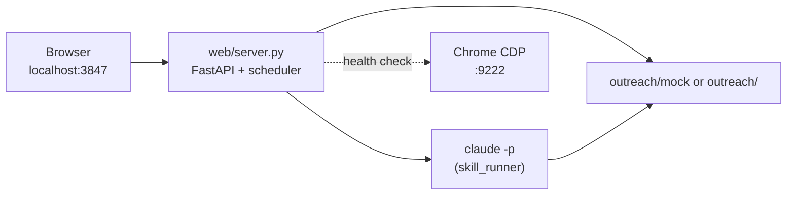

# Outreach web dashboard

Local FastAPI app for monitoring connections, scheduling skill routines, and triggering Claude skills from the browser. It reads the same outreach data tree as the LinkedIn MCP server (`outreach/` or `outreach/mock/`).

## Quick start

After [install](../README.md#one-command-install-clone-deps-mcp-skills-chrome):

```text
http://127.0.0.1:3847/
```

`./install.sh` starts the dashboard in the background (with Chrome and MCP setup). To start it manually:

```bash
make web
# or
uv run uvicorn web.server:app --host 127.0.0.1 --port 3847
```

Stop it:

```bash
make stop-web
```

Check status:

```bash
make status
```

Logs: `logs/server.log` (append mode when started by `install.sh`).

## What runs

| Component | Role |
|-----------|------|
| **Uvicorn** | Serves `web/server.py` (FastAPI) |
| **Static UI** | `web/dashboard.html`, `dashboard.css`, `dashboard.js` |
| **Routine scheduler** | Background asyncio loop (30s tick); runs active skills on interval |
| **Skill runner** | Invokes `claude -p "Run <skill> skill"` for manual runs and scheduled routines |

The dashboard does **not** replace the MCP server or the queue worker. It is a control plane on top of repo-local JSON/JSONL files.

## UI tabs

### Connections

Lists prospects from **`connections.json` only** (master registry). For each row:

- Identity: `name`, `title`, `profile_url`, `connection_status` from the connection record
- Stage / last action: from `conversations/{prospect_id}.json` when present

**Add connection** calls `POST /api/dashboard/connections` → runs the `send-connection-request` skill via Claude CLI.

### Routines & execution

- **Scheduled routines** — configured in `{outreach_base}/config/dashboard_routines.json`
- **Run now** (play button) — `POST /api/dashboard/routines/{id}/run`; updates `last_run_at` (resets the interval timer for active routines)
- **Routine run history** — append-only `logs/routine_runs.jsonl` (not queue or planned-message logs)

Default routines: `sync-pending-connections`, `conversation-planner` (both inactive until enabled in Configure).

### Meetings

Prospects with meeting interest from conversation files (meeting link, email, or scheduled end reason).

## HTTP API

| Method | Path | Description |
|--------|------|-------------|
| GET | `/` | Dashboard HTML |
| GET | `/api/dashboard/health` | Chrome CDP, Claude CLI, queue counts, LinkedIn session hint |
| GET | `/api/dashboard/connections` | Connection rows (see above) |
| POST | `/api/dashboard/connections` | Body: `{ "profile_url": "..." }` — send connection skill |
| GET | `/api/dashboard/routines` | Routines list + campaign goal |
| GET/PUT | `/api/dashboard/routines/config` | Raw routine config CRUD |
| POST | `/api/dashboard/routines/{routine_id}/run` | Run one skill now |
| GET | `/api/dashboard/execution-history` | Routine runs from `routine_runs.jsonl` |
| GET | `/api/dashboard/meetings` | Meeting-interest prospects |
| GET | `/api/dashboard/summary` | Aggregate counts |
| GET | `/api/dashboard/skills` | Allowed skill names |

## Data paths

Resolved by `web/dashboard_data.outreach_base()`:

| Env | Effect |
|-----|--------|
| `OUTREACH_DATA_ROOT` | Absolute path override (live data dir) |
| `OUTREACH_MOCK=1` (default) | Use `{repo}/outreach/mock` |
| `OUTREACH_MOCK=0` | Use `{repo}/outreach` |

Important files:

```text
{outreach_base}/
  connections.json          # Connections tab source of truth
  conversations/*.json      # Per-prospect stage and messages
  prospects/*.json            # Optional fallback if connection row lacks fields
  config/dashboard_routines.json
  logs/routine_runs.jsonl
  logs/planned_messages.jsonl # Not shown in routine history panel
```

## Environment variables

| Variable | Default | Purpose |
|----------|---------|---------|
| `WEB_HOST` | `127.0.0.1` | Bind address |
| `WEB_PORT` | `3847` | HTTP port |
| `OUTREACH_MOCK` | `1` | Mock vs live outreach tree |
| `OUTREACH_DATA_ROOT` | — | Override data directory |
| `CLAUDE_MODEL` | `haiku` | Model for `claude -p` skill runs |
| `CLAUDE_WEB_TIMEOUT_SEC` | `600` | Skill subprocess timeout |
| `REGRESSION_CLAUDE_PERMISSION_MODE` | `bypassPermissions` | Passed to Claude CLI |
| `CDP_URL` | `http://localhost:9222` | Chrome DevTools (health panel) |

## Architecture



## Troubleshooting

**Stale UI after code changes** — Restart the server (`make stop-web && make web`). Uvicorn is started without `--reload` by default.

**Wrong prospect list** — Ensure the running process loaded current code; connections tab only includes rows in `connections.json`.

**Skill run fails** — Confirm `claude` is on PATH (`which claude`). Check `logs/server.log` and the routine run note in the history table.

**Port already in use** — `make stop-web` or `lsof -ti :3847 | xargs kill`, then `make web`.
