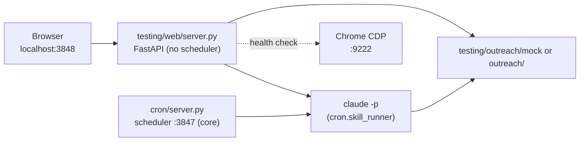

# Outreach web dashboard (dev/QA tool)

Local FastAPI app for monitoring connections, inspecting routine state, and triggering Claude skills from the browser. It lives under `testing/` and is **not** part of the production install — the unattended scheduler runs in the core `cron/server.py` process (port 3847). The dashboard reads the live outreach tree (`<repo>/outreach/`) or the mock tree (`testing/outreach/mock/`).

## Quick start

After [install](../../README.md#install-one-command), run **`/setup-outreach`** in Claude Code once to configure your operator profile ([details](../../docs/skills.md#setup-outreach-first-run-wizard)).

```text
http://127.0.0.1:3848/
```

Start it from the repo root:

```bash
make -C testing web
# or, from testing/
uv run uvicorn web.server:app --host 127.0.0.1 --port 3848
```

Stop it:

```bash
make -C testing stop-web
```

## What runs

| Component | Role |
|-----------|------|
| **Uvicorn** | Serves `testing/web/server.py` (FastAPI) |
| **Static UI** | `testing/web/dashboard.html`, `dashboard.css`, `dashboard.js` |
| **Skill runner** | Invokes `claude -p "Run <skill> skill"` for manual "Run now" triggers (imports `cron.skill_runner` from core) |

The background routine scheduler is **not** part of this process — it runs in the core `cron/server.py` (started by `install.sh` / `make cron`). The dashboard is a read-mostly view plus manual triggers on top of repo-local JSON/JSONL files.

## UI tabs

### Connections

Lists prospects from **`connections.json` only** (master registry). For each row:

- Identity: `name`, `title`, `profile_url`, `connection_status` from the connection record
- Stage / last action: from `conversations/{prospect_id}.json` when present

**Add connection** calls `POST /api/dashboard/connections` → runs the `send-connection-request` skill via Claude CLI.

### Routines & execution

- **Scheduled routines** — configured in `{outreach_base}/config/dashboard_routines.json`
- **Run now** (play button) — `POST /api/dashboard/routines/{id}/run`; updates `last_run_at` (resets the interval timer for active routines). Ignores the daily active window so operators can always trigger a run on demand.
- **Routine run history** — append-only `logs/routine_runs.jsonl` (not queue or planned-message logs)

Default install ships with the **per-prospect scheduler** (`scheduler_kind: "per_prospect"`) — two typed sweeps replace the old loop routines:

- **Connection sync sweep** — deterministic Python (no LLM); reads `connections.json`, probes `is_first_degree_connection` for pending rows whose `sync_backoff.next_check_at` is past, promotes accepted invites.
- **Conversation plan sweep** — dispatches `claude -p` per actionable prospect (single-prospect mode of `conversation-planner`), with `plan_backoff` per row.

Both honour daily caps in `tools/rate_limits.py` and exponential-backoff schedules configured under `per_prospect.{connection_sync,conversation_plan}.backoff` in `dashboard_routines.json`. See `docs/designs/per-connection-routines-with-backoff-design.md`.

Legacy `scheduler_kind: "loop"` is still supported for custom routines pointing at single-action skills (e.g. `reply-to-post`, `send-connection-request`).

#### Daily active window

Each routine has an optional `active_window_start` / `active_window_end` pair (24h `"HH:MM"` in **server local time**). When both are set, the scheduler only ticks the routine while the current local time is inside the window. New routines default to **09:00–17:00** (business hours); clear both fields in the Configure modal for 24/7 operation. Windows may cross midnight (e.g. `22:00`–`06:00`). Set the window in the **Configure** modal or directly in `dashboard_routines.json`. "Run now" still works outside the window — only the background scheduler honours it.

### Meetings

Prospects with meeting interest from conversation files (meeting link, email, or scheduled end reason).

## HTTP API

| Method | Path | Description |
|--------|------|-------------|
| GET | `/` | Dashboard HTML |
| GET | `/api/dashboard/health` | Chrome CDP, Claude CLI, LinkedIn session hint |
| GET | `/api/dashboard/connections` | Connection rows (see above) |
| POST | `/api/dashboard/connections` | Body: `{ "profile_url": "..." }` — send connection skill |
| GET | `/api/dashboard/routines` | Routines list + campaign goal |
| GET/PUT | `/api/dashboard/routines/config` | Raw routine config CRUD |
| POST | `/api/dashboard/routines/{routine_id}/run` | Run one skill now |
| GET | `/api/dashboard/execution-history` | Routine runs from `routine_runs.jsonl` |
| GET | `/api/dashboard/meetings` | Meeting-interest prospects |
| GET | `/api/dashboard/summary` | Aggregate counts |
| GET | `/api/dashboard/skills` | Allowed skill names |

## Data paths

Resolved by `testing/web/dashboard_data.outreach_base()`:

| Env | Effect |
|-----|--------|
| `OUTREACH_DATA_ROOT` | Absolute path override (live data dir) |
| `OUTREACH_MOCK=1` | Use `testing/outreach/mock` |
| `OUTREACH_MOCK=0` (default) | Use `{repo}/outreach` |

Important files:

```text
{outreach_base}/
  connections.json          # Connections tab source of truth
  conversations/*.json      # Per-prospect stage and messages
  prospects/*.json            # Optional fallback if connection row lacks fields
  config/dashboard_routines.json
  logs/routine_runs.jsonl
  logs/planned_messages.jsonl # Not shown in routine history panel
```

## Environment variables

| Variable | Default | Purpose |
|----------|---------|---------|
| `WEB_HOST` | `127.0.0.1` | Bind address |
| `WEB_PORT` | `3848` | HTTP port (core cron server owns 3847) |
| `OUTREACH_MOCK` | `0` | Mock vs live outreach tree |
| `OUTREACH_DATA_ROOT` | — | Override data directory |
| `CLAUDE_MODEL` | `haiku` | Model for `claude -p` skill runs |
| `CLAUDE_WEB_TIMEOUT_SEC` | `600` | Skill subprocess timeout |
| `REGRESSION_CLAUDE_PERMISSION_MODE` | `bypassPermissions` | Passed to Claude CLI |
| `CDP_URL` | `http://localhost:9222` | Chrome DevTools (health panel) |

## Architecture



## The cron server is the scheduler (production usage)

In production the workflow is driven by the core `cron/server.py` process, not the dashboard. Inside its FastAPI `lifespan` hook, `cron/routine_scheduler.scheduler_loop` ticks every 30 s and shells out to `claude -p "Run <skill>"` for any routine in `dashboard_routines.json` whose `active` flag is true and whose `interval_minutes` has elapsed since `last_run_at`.

`./install.sh` starts the cron server in the background (see `start_cron_server` in `install.sh`), so after the installer finishes the workflow runs unattended. The dashboard at `http://127.0.0.1:3848/` is optional — start it only when you want to inspect state or hand-toggle routines.

### Default routines (per-prospect scheduler)

A fresh install writes `{outreach_base}/config/dashboard_routines.json` with
`scheduler_kind: "per_prospect"` and these two sweeps active inside
business hours (09:00–17:00 server-local):

| Sweep | Initial cadence | Backoff curve | Active by default |
|-------|-----------------|---------------|-------------------|
| Connection sync (Python, no LLM) | 30 min | ×1.5 per "still pending" up to 24 h | yes |
| Conversation plan (per-prospect `claude -p`) | 60 min | ×2.0 per "no action" up to 12 h | yes |

Tune the schedules under `per_prospect.{connection_sync,conversation_plan}` in
`dashboard_routines.json`, or pause one by setting `active: false`. The
scheduler picks up file edits on the next tick.

`DEFAULT_ROUTINES` (legacy loop list) is now empty — the per-prospect sweep
covers the old defaults. Add custom loop routines (for `reply-to-post`,
`send-connection-request`, etc.) via the Configure modal if you want them.

### Notes

- `claude` must be on the PATH of whichever shell started `uvicorn`. `install.sh` inherits the user's PATH, so this normally works out of the box.
- LinkedIn rate limits (`tools/rate_limits.py`) apply per `tools/server.py` subprocess; back-to-back routine runs are safe.
- When `schedule_meeting` fires inside a routine run, the operator gets an SMTP email reminder if `OPERATOR_EMAIL` / `SMTP_HOST` are set in `.env` (see `.env.example`).
- `./install.sh` installs a **launchd** (macOS) or **systemd user** (Linux) unit via `bin/cron-service` so cron auto-starts at login and after reboot.

## Troubleshooting

**Stale UI after code changes** — Restart the server (`make -C testing stop-web && make -C testing web`). Uvicorn is started without `--reload` by default.

**Wrong prospect list** — Ensure the running process loaded current code; connections tab only includes rows in `connections.json`.

**Skill run fails** — Confirm `claude` is on PATH (`which claude`). Check the dashboard process output and the routine run note in the history table.

**Port already in use** — `make -C testing stop-web` or `lsof -ti :3848 | xargs kill`, then `make -C testing web`.
